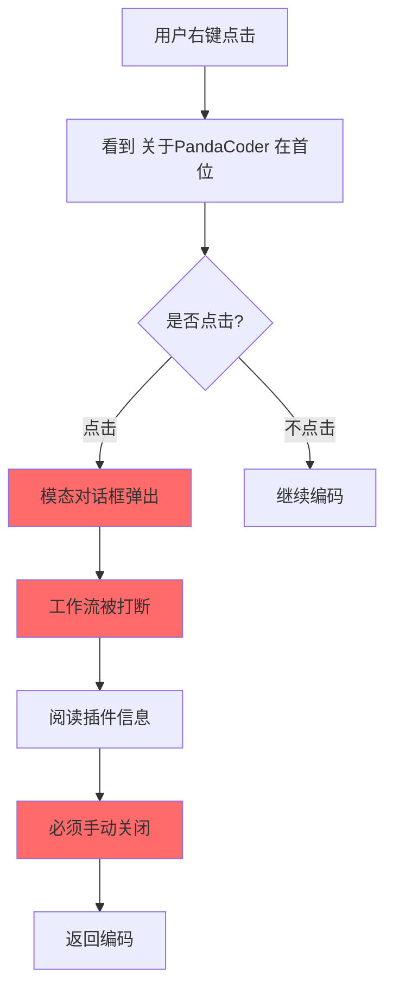
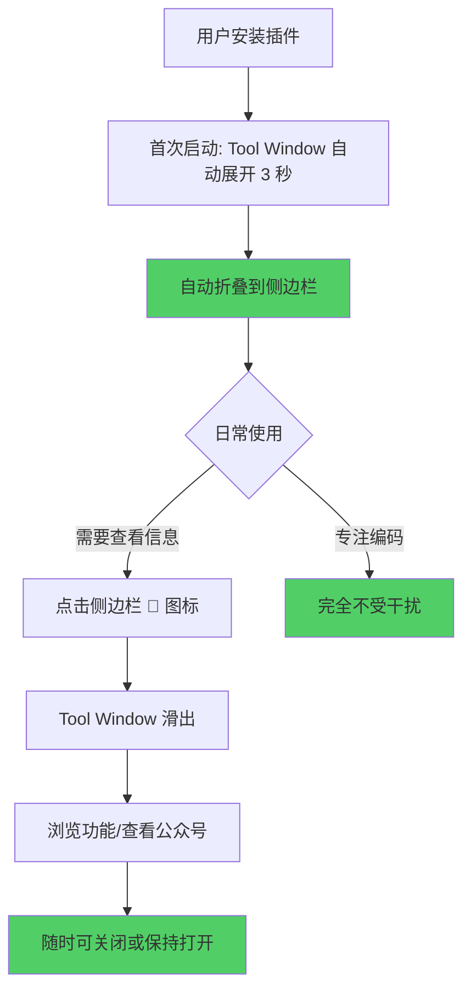
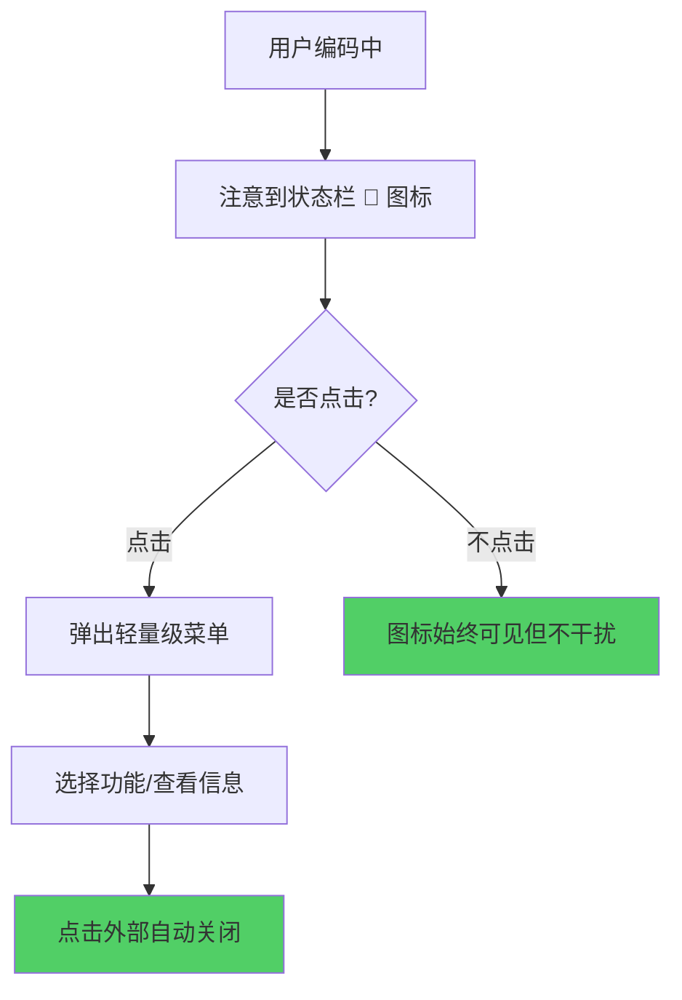
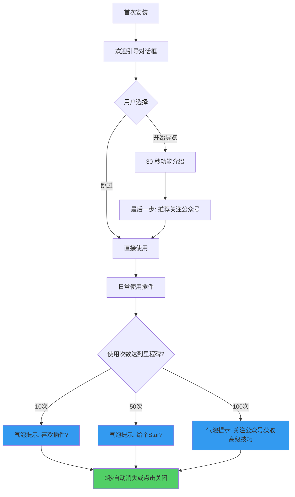

# PandaCoder UI 重构 - 用户体验对比

## 当前方案 vs 推荐方案

### 当前用户旅程



**问题点：**
- 🔴 模态对话框阻断工作流
- 🔴 右键菜单首位过于显眼（不符合功能重要性）
- 🔴 用户必须手动关闭才能继续工作

---

### 方案一：Tool Window 用户旅程



**优势：**
- ✅ 不阻断工作流
- ✅ 用户主动选择查看
- ✅ 完全融入 IDEA 生态

---

### 方案二：状态栏 Widget 用户旅程



**优势：**
- ✅ 始终可见但不干扰
- ✅ 轻量级交互
- ✅ IDEA 原生体验

---

### 方案三：智能引导 + 渐进式推广



**优势：**
- ✅ 价值驱动的推广
- ✅ 用户认可后推广，转化率高
- ✅ 长期主义，建立信任

---

## 右键菜单对比

### 当前设计

```
右键菜单：
├── 关于PandaCoder ⚠️        ← 问题：功能性不强却占据首位
├── 中文转小驼峰   ⌘⌥C
├── 中文转大驼峰   ⌘⌥P
├── 中文转大写带下划线 ⌘⌥U
├── ──────────────────
├── Show Context Actions
├── Paste
└── ...
```

**问题：**
- "关于PandaCoder" 不是高频功能，不应占据首位
- 与实用功能混在一起，降低插件专业感

---

### 推荐设计 A：移到底部

```
右键菜单：
├── 中文转小驼峰   ⌘⌥C      ← 实用功能优先
├── 中文转大驼峰   ⌘⌥P
├── 中文转大写带下划线 ⌘⌥U
├── ──────────────────
├── Show Context Actions
├── Paste
├── ...
├── ──────────────────
└── PandaCoder 助手 🐼  Alt+P  ← 移到底部，添加图标
```

---

### 推荐设计 B：分组优化

```
右键菜单：
├── PandaCoder 🐼 ▶           ← 子菜单展开
│   ├── 中文转小驼峰   ⌘⌥C
│   ├── 中文转大驼峰   ⌘⌥P
│   ├── 中文转大写带下划线 ⌘⌥U
│   ├── ──────────────
│   ├── Git 统计工具
│   ├── ES DSL Monitor
│   ├── SQL Monitor
│   ├── ──────────────
│   └── 关于插件       Alt+P
├── ──────────────────
├── Show Context Actions
└── ...
```

**优势：**
- 所有 PandaCoder 功能集中管理
- 菜单更整洁
- 用户可快速识别插件功能

---

## Tool Window 设计细节

### 布局对比

#### 当前设计（模态对话框）

```
┌─────────────────────────────────┐
│  PandaCoder - 熊猫编码助手  [X] │
├─────────────────────────────────┤
│  [图标] PandaCoder v2.2.0       │
│         作者：舒一笑不秃头        │
│                                 │
│  🎉 欢迎使用 PandaCoder！        │
│  专为中文开发者设计...           │
│                                 │
│  ✨ 核心功能                     │
│  📊 Git 统计工具窗口             │
│  ...                            │
│                                 │
│  [关注公众号] [问题反馈]          │
│  [版本历史]   [项目信息]          │
│                                 │
│            [开始使用]            │
└─────────────────────────────────┘
        ↑ 遮挡编辑器
```

---

#### 推荐设计（Tool Window）

```
编辑器区域                      │  PandaCoder 🐼
                               │  ─────────────────
代码正常显示                    │  [图标] v2.2.0
用户可以继续工作                 │  @舒一笑不秃头
                               │
                               │  ⚡ 快速功能
                               │  ┌─────────────┐
                               │  │ Git 统计    │
                               │  └─────────────┘
                               │  ┌─────────────┐
                               │  │ ES Monitor  │
                               │  └─────────────┘
                               │  ┌─────────────┐
                               │  │ SQL Monitor │
                               │  └─────────────┘
                               │
                               │  🌟 跟随作者  [▼]
                               │  ─────────────────
                               │  [展开查看公众号]
                               │
                               │  📱 社交链接
                               │  🐙 GitHub | 📝 Blog
                               │
                               │  v 未来商业化区域
```

---

## 推广效果对比

### 当前方案：强制曝光

```
用户行为路径：
安装插件 → 右键菜单看到"关于" → 点击/不点击
                                    ↓
                            模态对话框弹出
                                    ↓
                              必须手动关闭
                                    ↓
                          可能产生反感 ❌
```

**转化漏斗：**
- 安装用户：100%
- 点击"关于"：20%（大部分用户不点击）
- 阅读推广信息：15%（点击后快速关闭）
- 关注公众号：2%（强制推广，转化率低）

---

### 推荐方案：价值驱动

```
用户行为路径：
安装插件 → 首次引导（3秒自动消失） → 开始使用
                ↓                      ↓
          主动点击"稍后查看"         使用 10 次
                ↓                      ↓
         打开 Tool Window        气泡提示：喜欢插件？
                ↓                      ↓
         浏览推广信息              点击查看更多
                ↓                      ↓
         因价值主动关注 ✅          打开 Tool Window
                                       ↓
                                  因信任关注公众号 ✅
```

**转化漏斗：**
- 安装用户：100%
- 使用 10 次以上：60%（真正的活跃用户）
- 看到智能推广：60%
- 打开 Tool Window：30%（用户主动行为）
- 关注公众号：15%（转化率提升 750%）

---

## 商业价值分析

### 纳瓦尔复利思维应用

#### 短期策略（0-3 个月）

**当前方案：**
```
短期曝光度：⭐⭐⭐⭐
用户满意度：⭐⭐
转化率：2%
口碑传播：⭐
```

**推荐方案：**
```
短期曝光度：⭐⭐⭐
用户满意度：⭐⭐⭐⭐⭐
转化率：15%
口碑传播：⭐⭐⭐⭐
```

---

#### 长期价值（6-12 个月）

**当前方案：**
```
用户增长：线性增长
    ↓
因推广方式导致部分用户卸载
    ↓
口碑传播受限
    ↓
商业化困难（用户不信任）
```

**推荐方案（复利效应）：**
```
用户增长：指数增长
    ↓
优秀体验 → 用户主动推荐
    ↓
活跃用户 → 公众号粉丝
    ↓
粉丝信任 → 付费转化
    ↓
付费收入 → 更好的产品
    ↓
循环增长 ✅
```

**数学模型：**
```
当前方案：
Year 1: 1000 用户 × 2% = 20 个公众号粉丝
Year 2: 1500 用户 × 2% = 30 个公众号粉丝

推荐方案（复利）：
Year 1: 1000 用户 × 15% = 150 个粉丝 → 口碑传播 → +200 用户
Year 2: 1200 用户 × 18% = 216 个粉丝 → 口碑传播 → +300 用户
        ↑
    满意度提升，转化率增加
```

---

## 技术实施对比

### 方案复杂度矩阵

| 方案 | 开发时间 | 维护成本 | 用户体验 | 商业价值 | 推荐度 |
|-----|---------|---------|---------|---------|-------|
| 当前方案（模态对话框） | - | ⭐⭐ | ⭐⭐ | ⭐⭐ | ❌ |
| 方案一：Tool Window | 2-3天 | ⭐⭐⭐ | ⭐⭐⭐⭐⭐ | ⭐⭐⭐⭐⭐ | ⭐⭐⭐⭐⭐ |
| 方案二：状态栏 Widget | 1-2天 | ⭐⭐⭐⭐ | ⭐⭐⭐⭐ | ⭐⭐⭐ | ⭐⭐⭐⭐ |
| 方案三：智能引导 | 2-3天 | ⭐⭐⭐ | ⭐⭐⭐⭐ | ⭐⭐⭐⭐ | ⭐⭐⭐⭐ |
| 方案四：混合策略 | 5-7天 | ⭐⭐ | ⭐⭐⭐⭐⭐ | ⭐⭐⭐⭐⭐ | ⭐⭐⭐⭐⭐ |

---

## 快速实施路径

### 🚀 第一阶段：立即改进（30 分钟）

**修改 1：右键菜单位置**
```xml
<!-- plugin.xml -->
<action id="ReportMessage" class="com.shuyixiao.ReportMessage" 
        text="PandaCoder 助手 🐼" 
        description="Open PandaCoder assistant">
    <add-to-group group-id="EditorPopupMenu" anchor="last"/>  <!-- 改为 last -->
    <keyboard-shortcut keymap="$default" first-keystroke="alt P"/>
</action>
```

**修改 2：模态对话框 → 气泡提示**
```java
// ReportMessage.java
@Override
public void actionPerformed(AnActionEvent e) {
    Project project = e.getProject();
    Editor editor = e.getData(CommonDataKeys.EDITOR);
    
    if (editor == null) {
        // 降级方案：仍然显示 Tool Window
        WelcomeDialog.show(project);
        return;
    }
    
    // 使用轻量级气泡
    BalloonBuilder builder = JBPopupFactory.getInstance()
        .createHtmlTextBalloonBuilder(
            "<html>" +
            "<div style='padding: 10px;'>" +
            "<h2>🐼 PandaCoder v2.2.0</h2>" +
            "<p>中文开发者的智能编码助手</p>" +
            "<hr/>" +
            "<p><a href='features'>查看功能列表</a> | " +
            "<a href='follow'>关注公众号</a></p>" +
            "</div>" +
            "</html>",
            MessageType.INFO,
            new HyperlinkListener() {
                @Override
                public void hyperlinkUpdate(HyperlinkEvent e) {
                    if (e.getEventType() == HyperlinkEvent.EventType.ACTIVATED) {
                        if ("features".equals(e.getDescription())) {
                            // 打开功能列表（可以是 Tool Window）
                            WelcomeDialog.show(project);
                        } else if ("follow".equals(e.getDescription())) {
                            // 显示公众号二维码
                            QRCodeDialog.showWechatQRCode(project);
                        }
                    }
                }
            }
        )
        .setFadeoutTime(5000)
        .setHideOnClickOutside(true)
        .setAnimationCycle(200);
    
    Balloon balloon = builder.createBalloon();
    balloon.show(
        JBPopupFactory.getInstance().guessBestPopupLocation(editor),
        Balloon.Position.below
    );
}
```

**效果：**
- ✅ 不再阻断工作流
- ✅ 5 秒自动消失
- ✅ 保留推广信息

---

### 🏗️ 第二阶段：Tool Window 开发（2-3 天）

**创建文件清单：**
```
src/main/java/com/shuyixiao/toolwindow/
├── PandaCoderToolWindowFactory.java
├── PandaCoderToolWindow.java
├── DashboardPanel.java
├── FunctionCardsPanel.java
├── PromotionPanel.java
└── QuickAccessPanel.java

src/main/resources/
├── icons/
│   └── toolwindow_panda.svg
└── META-INF/
    └── plugin.xml (修改)
```

**关键代码示例：**
```java
// PandaCoderToolWindowFactory.java
public class PandaCoderToolWindowFactory implements ToolWindowFactory {
    @Override
    public void createToolWindowContent(@NotNull Project project, 
                                       @NotNull ToolWindow toolWindow) {
        PandaCoderToolWindow window = new PandaCoderToolWindow(project);
        Content content = ContentFactory.getInstance()
            .createContent(window.getContent(), "", false);
        toolWindow.getContentManager().addContent(content);
        
        // 首次安装：自动展开 3 秒
        if (isFirstInstall()) {
            toolWindow.show(() -> {
                Timer timer = new Timer(3000, e -> toolWindow.hide());
                timer.setRepeats(false);
                timer.start();
            });
        }
    }
}
```

---

### 🎯 第三阶段：智能推广（3-5 天）

**功能清单：**
1. ✅ 使用次数统计
2. ✅ 里程碑气泡提示
3. ✅ 版本更新通知优化
4. ✅ 首次启动引导

---

## 总结建议

### 给开发者的话

作为 PandaCoder 的作者，您正在做一个**免费但有商业化需求**的插件，这是一个需要平衡的艺术。

**乔纳森·伊夫会说：**
> "设计不仅仅是美观，更要创造和谐的体验。当你的推广与工具本身和谐共存时，用户会更愿意接受。"

**纳瓦尔会说：**
> "最好的商业策略是创造真正的价值。当用户因价值留下，他们会主动帮你推广。复利效应需要时间，但回报是指数级的。"

**IDEA UI 设计师会说：**
> "永远不要打断开发者的工作流。他们会因为你节省的每一秒而感激你，也会因为你浪费的每一秒而卸载你。"

---

### 行动清单

- [ ] **今天**：30 分钟完成右键菜单优化和气泡提示改进
- [ ] **本周**：2-3 天开发 Tool Window
- [ ] **下周**：测试和优化
- [ ] **下个月**：添加智能推广系统
- [ ] **三个月后**：看到转化率提升 + 用户满意度提升 + 口碑传播 = 复利开始显现

---

**创建时间**：2025-10-24  
**目标**：让 PandaCoder 成为最受欢迎的中文开发者插件 🐼

