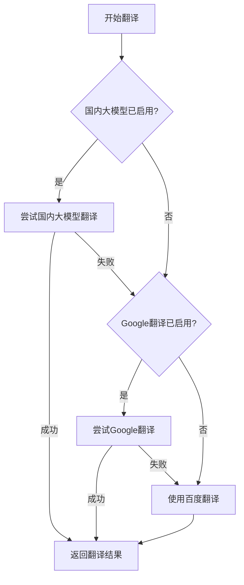

# PandaCoder 多引擎翻译功能使用指南

## 🎯 功能概述

PandaCoder 插件现已支持**三级翻译引擎智能切换**，为您提供更可靠、更高质量的中英文翻译服务。

### 支持的翻译引擎

1. **国内大模型翻译** 🥇 (最高优先级)
   - 通义千问 (Qianwen)
   - 文心一言 (Wenxin)  
   - 智谱 AI (Zhipu GLM-4)

2. **Google Cloud Translation** 🥈 (第二优先级)
   - 谷歌云翻译API
   - 支持多区域部署

3. **百度翻译** 🥉 (备用引擎)
   - 百度翻译API
   - 作为最终备用方案

## 🔧 配置步骤

### 1. 打开设置面板

在 IntelliJ IDEA 中：
- Windows/Linux: `File` → `Settings` → `Tools` → `PandaCoder`
- macOS: `IntelliJ IDEA` → `Preferences` → `Tools` → `PandaCoder`

### 2. 配置国内大模型（推荐）

#### 通义千问配置
1. 选择「启用国内大模型翻译」
2. 国内大模型选择：`qianwen`
3. API密钥：在阿里云DashScope申请
   - 访问：https://dashscope.aliyun.com/
   - 获取API Key并填入

#### 文心一言配置
1. 选择「启用国内大模型翻译」
2. 国内大模型选择：`wenxin`
3. API密钥：在百度智能云申请
   - 访问：https://cloud.baidu.com/product/wenxinworkshop
   - 获取Access Token并填入

#### 智谱AI配置
1. 选择「启用国内大模型翻译」
2. 国内大模型选择：`zhipu`
3. API密钥：在智谱AI开放平台申请
   - 访问：https://open.bigmodel.cn/
   - 获取API Key并填入

### 3. 配置Google Cloud Translation（可选）

1. 启用「Google Cloud Translation」
2. 填入以下信息：
   - **API Key**: Google Cloud Console中的API密钥
   - **Project ID**: GCP项目ID
   - **Region**: 选择服务区域（默认：global）

### 4. 配置百度翻译（建议保留作为备用）

1. 填入百度翻译API信息：
   - **应用ID**: 百度翻译开放平台的APP ID
   - **API密钥**: 百度翻译API密钥

## 🚀 使用方法

### 智能翻译优先级

系统会按以下顺序自动选择翻译引擎：

1. **国内大模型** - 如果已配置且可用
2. **Google翻译** - 国内大模型不可用时
3. **百度翻译** - 前两者都不可用时的最终备用

### 代码转换功能

#### 1. 选中文本转换
- 在编辑器中选中中文文本
- 右键选择相应的转换选项：
  - 转换为小驼峰命名 (camelCase)
  - 转换为大驼峰命名 (PascalCase) 
  - 转换为下划线大写 (UPPER_CASE)

#### 2. 创建中文类名
- 在项目结构中右键选择文件夹
- 选择「智能中文类」
- 输入中文类名，支持前缀语法：
  - `Service:用户管理` → `ServiceUserManagement`
  - `Controller用户登录` → `ControllerUserLogin`

## ✅ 配置验证

每个翻译引擎都提供配置验证功能：

- 点击对应的「验证配置」按钮
- 系统会进行实际翻译测试
- 显示验证结果和示例翻译

## 🔄 引擎切换逻辑



## 🎯 最佳实践

### 推荐配置组合

**方案一：纯国内方案**
- 国内大模型：通义千问
- 备用：百度翻译

**方案二：国际化方案** 
- 主要：Google Cloud Translation
- 备用：百度翻译

**方案三：全覆盖方案**
- 主要：国内大模型（通义千问/文心一言）
- 备用1：Google翻译  
- 备用2：百度翻译

### 使用建议

1. **优先配置国内大模型** - 翻译质量更高，更适合编程术语
2. **保留百度翻译配置** - 作为最终备用方案，确保功能可用性
3. **定期验证配置** - 确保API密钥未过期，服务正常可用
4. **合理使用频次** - 注意各平台的API调用限额

## 🔒 安全提醒

- API密钥均以密文存储
- 建议定期更换API密钥
- 不要在代码或文档中明文保存密钥
- 注意各平台的使用条款和费用政策

## 🛠️ 故障排除

### 常见问题

**Q: 翻译失败，提示API配置错误**
- A: 检查API密钥是否正确，账户是否有余额

**Q: 国内大模型翻译很慢**  
- A: 首次调用可能较慢，后续调用会更快

**Q: Google翻译无法使用**
- A: 检查网络连接，确认API密钥和Project ID正确

**Q: 所有翻译引擎都失败**
- A: 检查网络连接，验证至少一个API配置正确

### 日志查看

在 IDEA 控制台可查看翻译引擎切换日志：
```
国内大模型翻译失败，尝试其他翻译引擎: [错误信息]
Google翻译失败，尝试百度翻译: [错误信息]
```

## 📞 技术支持

如遇问题，请提供以下信息：
- IDEA版本和插件版本
- 错误日志和截图  
- 使用的翻译引擎配置
- 网络环境描述

---

**享受智能编程，从优雅的中文命名开始！** 🐼✨ 